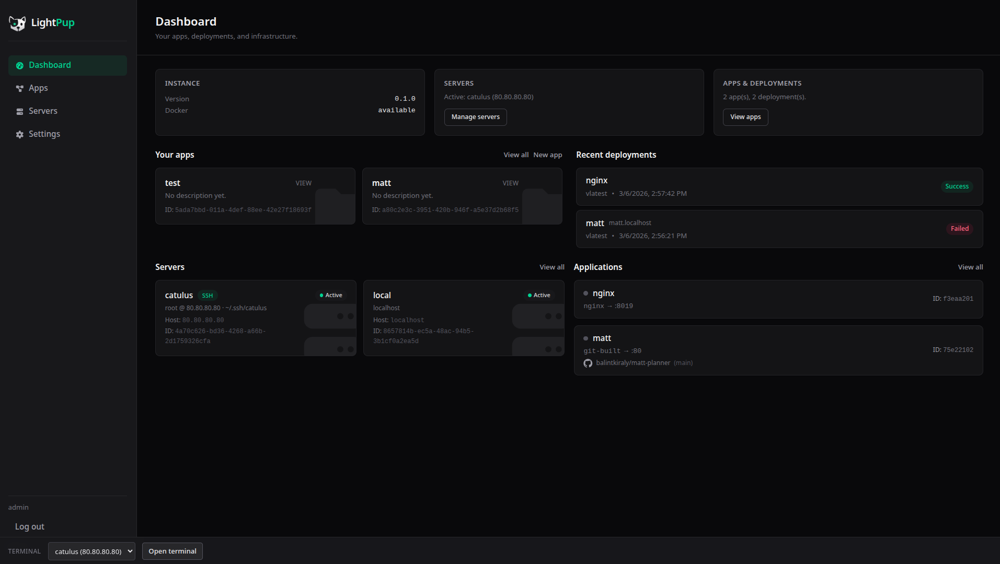

# LightPup

> **Warning**: This project is under active development and is not production ready. Use at your own risk.



A lightweight, self-hosted PaaS platform built with Rust and React.

## Features

- **Application Deployments** - Deploy and manage your applications with ease
- **Preview Environments** - Automatic preview deployments for pull requests
- **Docker Integration** - Build and run containers using Docker
- **Reverse Proxy** - Built-in proxy for routing traffic to your services
- **Dashboard** - Modern web UI for managing all your projects

## Tech Stack

- **Backend**: Rust with Axum, SQLite
- **Frontend**: React + Vite + TypeScript

## Quick Start

### Backend

```bash
cd backend
cargo run
```

Run tests:
```bash
cd backend
cargo test
```

### Frontend

```bash
cd frontend
pnpm install
pnpm dev
```

Build for production:
```bash
cd frontend
pnpm build
```

## License

MIT
